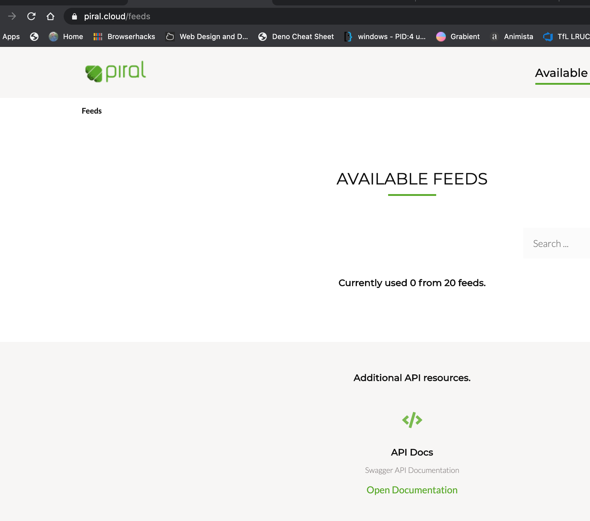
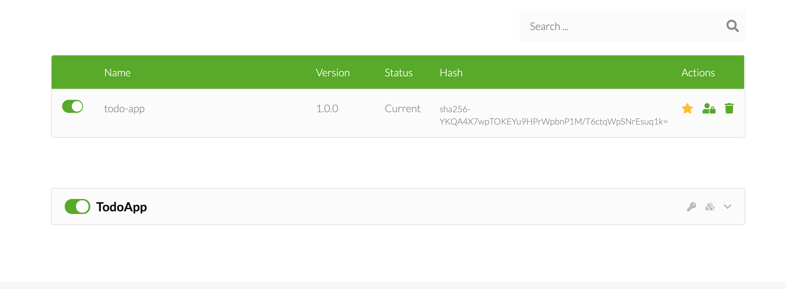
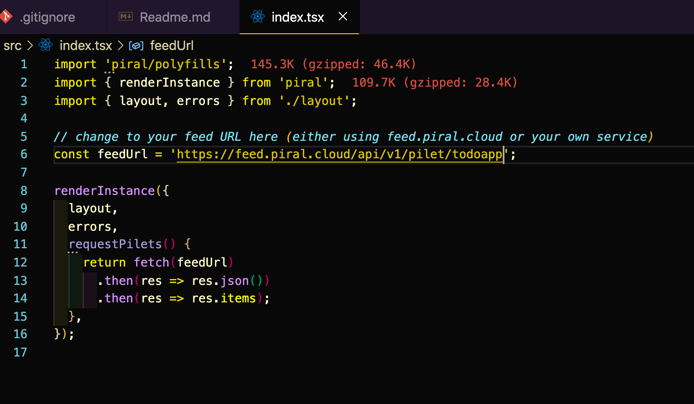

# Introduction

This is a sample code using micro frontend design strategy. I am using Piral for this.

The main building blocks for piral are:

- An application shell.
- Pilets are standalone modules which contains independent functionality and it can be dynamically loaded into the app shell.
- A Pilet Feed Service (this is a private NPM registry where you can push your pilets.)

Each pilet can be a micro-repository!

| Commaand                                                                           | Description                                                                                                                            |
| ---------------------------------------------------------------------------------- | -------------------------------------------------------------------------------------------------------------------------------------- |
| piral new --target micro-frontend-sample                                           | This command will create an application shell                                                                                          |
| piral debug                                                                        | This command will launch the application in debug mode                                                                                 |
| piral build                                                                        | This command will build the assets for production                                                                                      |
| piral build --type emulator                                                        | This command will build the emmulator                                                                                                  |
| piral build                                                                        | You will notice two folders release and emulator. Emulator will contain a tgz file which is normally pushed to a private NPM registry  |
| pilet new dist/emulator/micro-frontend-sample-1.0.0.tgz --target packages/todo-app | You will notice two folders release and emulator. Emulator will contain a tgz file which is normally pushed to a private NPM registry  |
| cd packages/todo-app                                                               | You can navigate to the pilet folder which is todo-app and run `pilet debug` command.                                                  |
| Navigate to https://www.piral.cloud/                                               | You have to use microsoft account to login, if you have your own private registry in Azure or any where else setup the assets registry |

## How to use Piral registry service

If you want to use the Piral registry then you have to use a microsoft live account. Once login is successful you will be redirected to this page.



In order to create a new asset click on the **Create Feed** link and setup a new feed. When feed is created then you wil lbe redirected to the main page where you
will see the feed you have created. Click on the Manage Api keys to setup a new key for your pilet. Once the key is generated it copy this and save it as you will not see this next time.

In order to publish the pilet navigate to the pilet folder in our case it is **todo-app** and run this command.

```sh

pilet publish --fresh --url <<feed_url>> --api-key <<key>>

```

Once published you will see something similar!



Once this is published we need to update the feed url in the app shell index.tsx file.



### Further reading

- FrintJS
- Mosaic
- Podium
- Open Components
- One App
- PuzzleJS
- NUT
- Luigi
- Micromono
- qiankun
